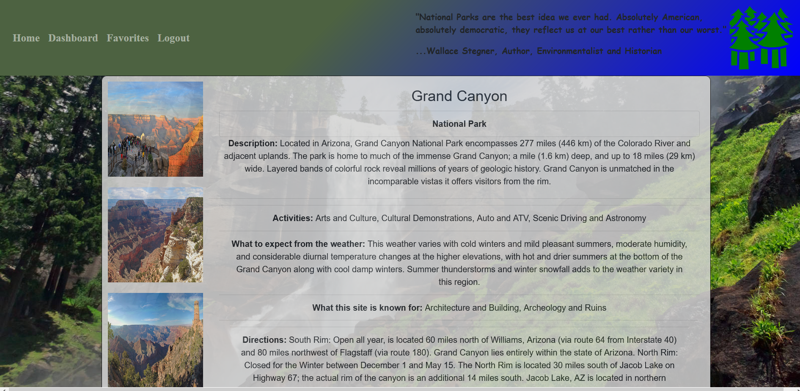

# Passage 
## Passage is a web application that allows the user to search for National Parks, Monuments, Trails and Historic Sites to explore. The search is done by individual State and the user has the option of saving their favorite destinations. Once saved in Favorites, the user can access an up to date five day weather forecast to help plan their trip or their activites once at the site they choose to visit.

## This application was collaborated on by Brad Tomlinson, Hannah Ferris, John McCauley and Clark Tyra and Jaired Jawed. It was originated as a class project and then expanded upon by Brad Tomlinson. If you have any questions, feel free to email Brad at brt.jst@gmail.com or visit the Github Repo at: https://github.com/bradfan/real-parks

## Deployed Link: https://passage-real-parks.herokuapp.com/signup

npm run start for local host

 